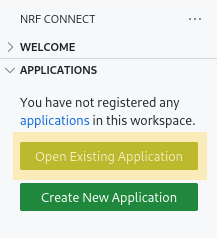
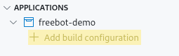
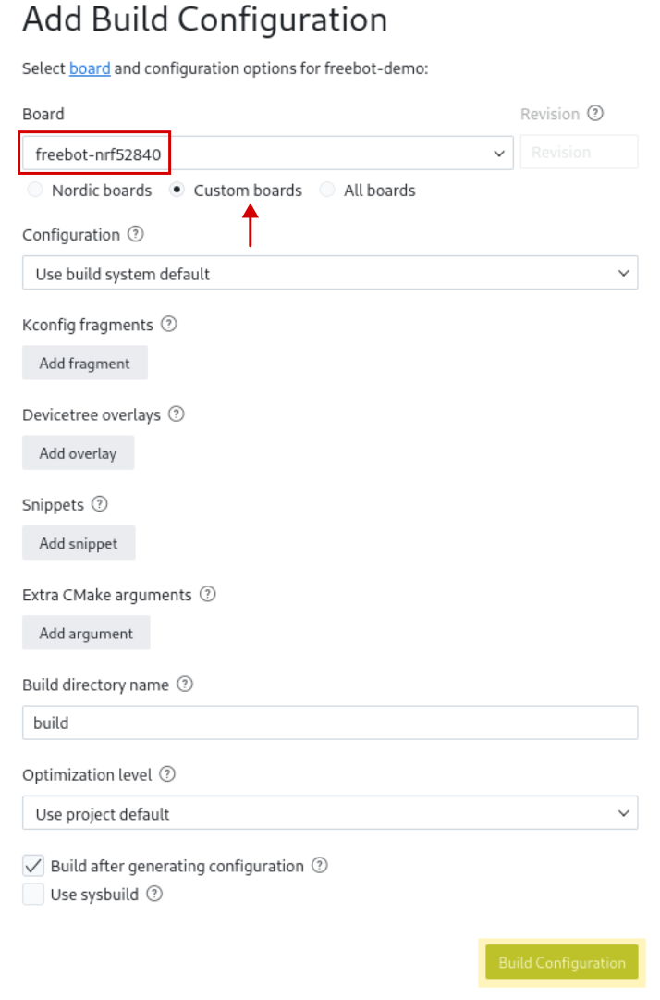
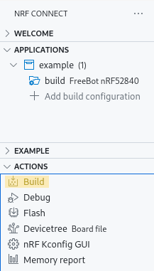

# FreeBot example using Zephyr

> DISCLAIMER: This readme is outdated!

- [FreeBot example using Zephyr](#freebot-example-using-zephyr)
  - [Setup](#setup)
  - [Build](#build)
  - [Flash](#flash)
  - [Debug](#debug)

## Setup

1. Install [nRF Connect SDK and toolchain](https://academy.nordicsemi.com/courses/nrf-connect-sdk-fundamentals/lessons/lesson-1-nrf-connect-sdk-introduction/topic/exercise-1-1/)

2. Install [pyOCD](https://pyocd.io/docs/installing) (`pip install pyocd` for most systems)

3. Fetch submodules: `git submodule update --init`

4. If not present, add the workspace folder as an nRF connect application:
   <br>{width=20%}

5. If not present, create a build configuration:
   1. <br>{width=20%}
   2. <br>{width=30%}

## Build

{width=20%}


## Flash

First, verify that the robot's wheels are in the following configuration:
<br> {width=20%}

Connect the robot and verify that it's [DAPLink](https://github.com/ARMmbed/DAPLink) interface is found.

```
$ pyocd list

  #   Probe/Board             Unique ID                                          Target
-----------------------------------------------------------------------------------------
  0   Arm DAPLink CMSIS-DAP   00000080066aff574884654867025126a5a5a5a597969908   n/a
```

Next, pyOCD can be used to flash the FreeBot's nRF52840

```
$ pyocd load -t nrf52840 build/zephyr/zephyr.hex

0000484 I Loading build/zephyr/zephyr.hex [load_cmd]
[==================================================] 100%
0003017 I Erased 40960 bytes (10 sectors), programmed 40960 bytes (10 pages), skipped 0 bytes (0 pages) at 15.86 kB/s [loader]

```

## Debug

First start pyOCD's GDB server:
```
$ pyocd gdbserver -t nrf52840

0000328 I Target type is nrf52840 [board]
0000376 I DP IDR = 0x2ba01477 (v1 rev2) [dap]
0000389 I AHB-AP#0 IDR = 0x24770011 (AHB-AP var1 rev2) [discovery]
0000391 I AP#1 IDR = 0x02880000 (AP var0 rev0) [discovery]
0000423 I NRF52840 not in secure state [target_nRF52]
0000464 I AHB-AP#0 Class 0x1 ROM table #0 @ 0xe00ff000 (designer=244 part=008) [rom_table]
0000468 I [0]<e000e000:SCS v7-M class=14 designer=43b:Arm part=00c> [rom_table]
0000470 I [1]<e0001000:DWT v7-M class=14 designer=43b:Arm part=002> [rom_table]
0000473 I [2]<e0002000:FPB v7-M class=14 designer=43b:Arm part=003> [rom_table]
0000475 I [3]<e0000000:ITM v7-M class=14 designer=43b:Arm part=001> [rom_table]
0000478 I [4]<e0040000:TPIU M4 class=9 designer=43b:Arm part=9a1 devtype=11 archid=0000 devid=ca1:0:0> [rom_table]
0000481 I [5]<e0041000:ETM M4 class=9 designer=43b:Arm part=925 devtype=13 archid=0000 devid=0:0:0> [rom_table]
0000485 I CPU core #0: Cortex-M4 r0p1, v7.0-M architecture [cortex_m]
0000485 I   Extensions: [DSP, FPU, FPU_V4, MPU] [cortex_m]
0000485 I   FPU present: FPv4-SP-D16-M [cortex_m]
0000487 I This appears to be an nRF52840 QIAA D0 [target_nRF52]
0000488 I 4 hardware watchpoints [dwt]
0000490 I 6 hardware breakpoints, 4 literal comparators [fpb]
0000498 I Semihost server started on port 4444 (core 0) [server]
0000604 I GDB server started on port 3333 (core 0) [gdbserver]
```

Next, if GDB is installed, you can connect to it (in another terminal) by running:
```
$ gdb -ex "target remote localhost:3333" -ex "monitor reset" -ex "load" -ex "break main" build/zephyr/zephyr.elf

...
(gdb)
```
